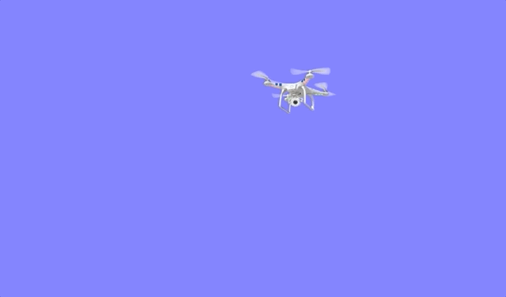

# UAV Motion Simulator 

[](https://poser.pugx.org/ali-irawan/xtra/license.svg)


This simulator is based on our work considering UAV motion in atmosphere. The Turbulence caused by wind gusts were modelled by the very 
famous Dryden wind model. More details about this Dryden model can be found in https://en.wikipedia.org/wiki/Dryden_Wind_Turbulence_Model.


## Table of contents
* [General info](#general-info)
* [Prerequisites](#Prerequisites)
* [Setup](#setup)
* [Sample output](#sample-output)

## General info
This is a simple C++ programme that utilizes ```open source SDL library``` used for `games` to create the  UAV motion simulation 
under wind gusts. The wind gusts is modelled by Dryden wind motion. 
* To run this program, you need to have `SDL2` and `SDL2_image` library package.
* Also, you need to have `gcc` compiler.
* SDL tutorial credit goes to ```https://lazyfoo.net/tutorials/SDL/```, and ```https://youtu.be/QQzAHcojEKg```. The youtube tutorial is the best, and used a lot in this project.
* If you like this work or you are reusing part of this repository for your research, please cite my paper, ```A. Kachroo et al., "Emulating UAV Motion by Utilizing Robotic Arm for mmWave Wireless Channel Characterization," in IEEE Transactions on Antennas and Propagation, vol. 69, no. 10, pp. 6691-6701, Oct. 2021, doi: 10.1109/TAP.2021.3069484.```
	
## Prerequisites
The following packages are required:
* C++: gcc compiler
* SDL2: https://www.libsdl.org/download-2.0.php
* SDL2_image: https://www.libsdl.org/projects/SDL_image/ 
* ROS log files in ```.csv``` format without empty columns (I still need to work better with the csvReader module)

	
## Setup
To run this project, download this repository to your computer. Open the folder and run the following script from the terminal:
```
$make
```
Once successfully compiled, run the simulator with,

```
./uavSim

```

To clean, run
```
$make clean
```
or to completely clean,

```
$make cleanall

```

## Sample output

Here is the output. 

 

More data will be added, once the research paper is published.


